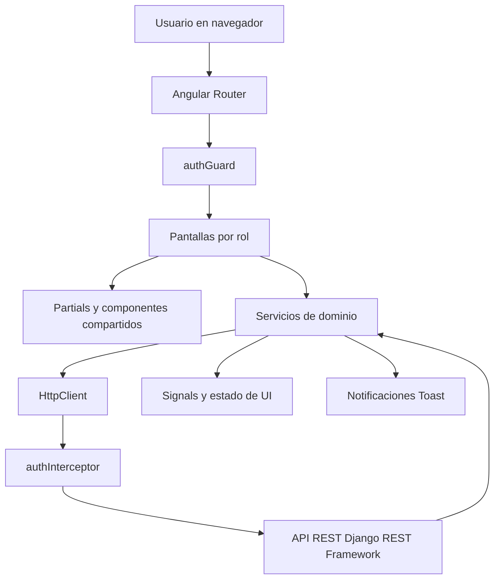

# Arquitectura del proyecto GTEA WebApp

## 1. Objetivo del documento

Este documento describe la arquitectura utilizada por el frontend de GTEA, sus responsabilidades y la forma en que sus piezas se relacionan. Sirve como guía para:

- Entender el funcionamiento general de la aplicación.
- Incorporar nuevas pantallas, servicios o endpoints sin romper la organización existente.
- Localizar rápidamente el archivo responsable de cada comportamiento.
- Explicar el flujo de autenticación, navegación y comunicación con el backend.
- Facilitar el mantenimiento, las pruebas y la incorporación de nuevos integrantes al proyecto.

GTEA es una aplicación web para la gestión de talleres, eventos, aulas, sedes, usuarios, inscripciones y listas de espera. El frontend atiende tres perfiles principales: administrador, organizador y alumno.

## 2. Resumen de la arquitectura

El proyecto utiliza una arquitectura frontend por capas y orientada a funcionalidades, implementada con Angular 20 y componentes standalone. No utiliza NgModules para organizar las pantallas: cada componente declara directamente sus dependencias y se carga desde el enrutador cuando es necesario.

La aplicación se puede resumir así:



Las decisiones principales son:

- **Angular standalone:** reduce el acoplamiento y evita módulos de funcionalidad innecesarios.
- **Arquitectura por pantallas y servicios:** las pantallas representan casos de uso y los servicios encapsulan la comunicación con la API.
- **Carga diferida:** las rutas utilizan `loadComponent()` para descargar una pantalla únicamente cuando se visita.
- **Reactividad zoneless:** se utiliza `provideZonelessChangeDetection()` y Angular Signals para el estado visual síncrono.
- **RxJS:** se utiliza para las operaciones HTTP y sus respuestas asíncronas.
- **Seguridad en dos puntos:** el guard controla el acceso a las rutas y el interceptor añade el token a las peticiones.
- **SSR/hidratación configurados:** la aplicación incluye la configuración de Angular SSR y protege el acceso a `localStorage` y `sessionStorage` durante el renderizado del servidor.

## 3. Capas y responsabilidades

### 3.1. Capa de entrada y composición

Archivos principales:

- `src/main.ts`: inicia la aplicación con `bootstrapApplication()`.
- `src/app/app.ts`: componente raíz; contiene el `RouterOutlet` y el sistema global de Toast.
- `src/app/app.config.ts`: registra el router, el cliente HTTP, el interceptor, la hidratación y la detección de cambios zoneless.

Esta capa ensambla la aplicación, pero no debería contener reglas de negocio de eventos, usuarios o inscripciones.

### 3.2. Capa de navegación

Archivo principal: `src/app/app.routes.ts`.

El router define:

- Rutas públicas: `landing`, `login` y `registro`.
- Rutas protegidas de `admin`.
- Rutas protegidas de `alumno`.
- Rutas protegidas de `organizador`.
- Redirecciones por defecto y una ruta comodín hacia `landing`.

Cada pantalla se importa con `loadComponent()`. Esto permite lazy loading y evita cargar toda la aplicación al inicio.

### 3.3. Capa de presentación

Ubicación: `src/app/screens/`.

Las pantallas se agrupan por contexto funcional:

- `landing-screen`: entrada pública.
- `login-screen`: inicio de sesión.
- `registro-screen`: registro de usuarios.
- `admin`: dashboard, sedes, categorías, usuarios, eventos y reportes.
- `alumno`: catálogo, detalle de evento, mis eventos, historial y perfil.

Una pantalla debe encargarse principalmente de:

- Leer la interacción del usuario.
- Mantener el estado visual de la vista.
- Validar o preparar los datos del formulario.
- Invocar el servicio adecuado.
- Mostrar el resultado mediante componentes compartidos o Toast.

La pantalla no debería duplicar la construcción de URLs ni implementar la lógica general de autenticación.

### 3.4. Componentes de composición y reutilización

Ubicaciones:

- `src/app/partials/`: elementos de layout como `top-navbar`, `bottom-nav`, `footer` y `back-header`.
- `src/app/shared/`: componentes reutilizables entre roles, como Toast, pipes y modales.
- `src/app/modals/`: modales asociados a casos de uso concretos.

Estos componentes sirven para mantener una interfaz consistente y evitar repetir markup, estilos y comportamiento común en cada pantalla.

### 3.5. Capa de servicios

Ubicación: `src/app/services/`.

Los servicios se registran con `providedIn: 'root'` y encapsulan operaciones HTTP, validaciones auxiliares y parte de la lógica de aplicación.

Servicios principales:

| Servicio | Responsabilidad |
| --- | --- |
| `facade-service.ts` | Login, logout, registro por dominio, sesión y datos básicos del usuario. |
| `admin-service.service.ts` | Operaciones de administración de usuarios y datos del administrador. |
| `alumno-service.ts` | Registro, consulta, edición y eliminación de alumnos. |
| `organizador-service.ts` | Registro, consulta, edición y eliminación de organizadores. |
| `evento-service.ts` | Operaciones relacionadas con eventos. |
| `categoria.service.ts` | Consulta y gestión de categorías. |
| `sede.service.ts` | Gestión de sedes y aulas. |
| `inscripcion.service.ts` | Inscripciones, cancelaciones y listas de espera. |
| `perfil.service.ts` | Operaciones del perfil del usuario. |
| `tools/validator-service.ts` | Validaciones reutilizables de formularios. |
| `tools/errors-service.ts` | Mensajes de error de validación. |
| `tools/toast.service.ts` | Publicación y control de notificaciones Toast. |

Los servicios devuelven `Observable` en las operaciones asíncronas. Las pantallas se suscriben a ellos para actualizar la interfaz y procesar errores o respuestas del backend.

### 3.6. Contratos y modelos

Ubicación: `src/app/models/`.

Los modelos representan contratos compartidos entre la API y la interfaz. Por ejemplo, `inscripcion.model.ts` define `RespuestaInscripcion` y los tipos de Toast.

Cuando una respuesta tiene una estructura estable, debe declararse una interfaz y utilizarse como tipo genérico de `HttpClient`, por ejemplo `http.post<RespuestaInscripcion>(...)`. Esto hace visible el contrato esperado y reduce errores al consumir la API.

## 4. Flujo de una petición autenticada

El flujo normal de una operación contra el backend es:

1. El usuario interactúa con una pantalla.
2. La pantalla llama a un servicio de dominio.
3. El servicio construye la petición mediante `HttpClient` usando la URL del entorno.
4. `authInterceptor` obtiene el token desde `localStorage` o `sessionStorage`.
5. Si la petición no es pública, el interceptor añade `Authorization: Token <token>`.
6. Django REST Framework procesa la petición y devuelve la respuesta.
7. El servicio entrega un `Observable` a la pantalla.
8. La pantalla actualiza Signals/estado visual y muestra el resultado o un Toast.

El interceptor omite el encabezado de autenticación en las peticiones POST de login y registro. Esto evita enviar tokens caducados o inválidos a endpoints públicos.

## 5. Autenticación y autorización

### 5.1. Inicio y cierre de sesión

`FacadeService` centraliza el login, logout y la persistencia de datos básicos de la sesión. Después del login se guardan, según la opción elegida por el usuario, datos como:

- Token.
- Identificador del usuario.
- Correo electrónico.
- Nombre completo.
- Rol o grupo.

La aplicación usa `localStorage` para sesiones persistentes y `sessionStorage` para sesiones de duración limitada.

### 5.2. Protección de rutas

`authGuard` se ejecuta en las rutas de `admin`, `alumno` y `organizador`. Compara el primer segmento de la URL con el rol almacenado por `FacadeService`.

Reglas actuales:

- `admin` requiere el rol `administrador`.
- `alumno` requiere el rol `alumno`.
- `organizador` requiere el rol `organizador`.
- Un `organizador` puede acceder a las pantallas administrativas que comparte la configuración actual.
- Si no existe sesión, se redirige a `/login`.
- Si el rol no corresponde, se redirige al inicio permitido para ese rol.

El guard mejora el control de navegación del frontend, pero la autorización definitiva debe mantenerse en el backend. Un usuario puede modificar el almacenamiento del navegador, por lo que Django REST Framework debe validar siempre el token, el rol y los permisos de cada endpoint.

### 5.3. Compatibilidad con SSR

Durante SSR no existe `window`, `localStorage` ni `sessionStorage`. Por eso `authGuard`, `authInterceptor` y `FacadeService` comprueban `isPlatformBrowser()` antes de acceder al almacenamiento del navegador.

## 6. Estado y reactividad

El proyecto combina dos mecanismos:

| Mecanismo | Uso en el proyecto |
| --- | --- |
| Angular Signals | Estado síncrono de la interfaz: carga, edición, cupos, visibilidad y mensajes visuales. |
| RxJS | Peticiones HTTP, respuestas asíncronas, errores y transformación de flujos. |

La detección de cambios es zoneless mediante `provideZonelessChangeDetection()`. Por ello, el estado que afecte a la plantilla debe actualizarse con Signals u otros mecanismos reconocibles por Angular, en lugar de depender de cambios implícitos de Zone.js.

## 7. Configuración por entorno

Los archivos de `src/environments/` proporcionan la URL base de la API:

- `environment.development.ts`: configuración para desarrollo.
- `environment.prod.ts`: configuración para producción.
- `environment.ts`: configuración usada como archivo base y reemplazada por Angular según la configuración de build.

`angular.json` configura el reemplazo de archivos:

- `ng serve` utiliza la configuración `development`.
- `ng build` utiliza por defecto la configuración `production`.

Para cambiar el backend, se debe actualizar la URL en el entorno correspondiente y comprobar que todos los servicios construyan sus endpoints a partir de `environment.url_api`.

## 8. SSR, hidratación y servidor

La aplicación incluye:

- `src/main.server.ts` como entrada server-side.
- `src/app/app.config.server.ts` para combinar la configuración común con `provideServerRendering()`.
- `src/app/app.routes.server.ts` para la configuración específica de rutas del servidor.
- `src/server.ts` con Express y `AngularNodeAppEngine`.

El servidor Express sirve los archivos estáticos generados y delega las solicitudes restantes a Angular para renderizar la aplicación. La configuración del cliente incluye `provideClientHydration(withEventReplay())`, que permite reutilizar el HTML generado en el servidor y reproducir eventos ocurridos antes de completar la hidratación.

## 9. Estructura de directorios relevante

```text
src/
├── main.ts                         # Entrada del navegador
├── main.server.ts                  # Entrada SSR
├── server.ts                       # Express + Angular SSR
├── styles.scss                     # Estilos globales
├── environments/                   # Configuración por entorno
└── app/
    ├── app.ts                      # Componente raíz
    ├── app.config.ts               # Providers globales
    ├── app.config.server.ts        # Providers SSR
    ├── app.routes.ts               # Rutas del cliente
    ├── app.routes.server.ts        # Rutas SSR
    ├── guards/                     # Protección de navegación
    ├── interceptors/               # Intercepción HTTP
    ├── models/                     # Interfaces y tipos
    ├── services/                   # Servicios de dominio y utilidades
    ├── screens/                    # Pantallas por rol y funcionalidad
    ├── partials/                   # Layout reutilizable
    ├── shared/                     # Elementos compartidos
    └── modals/                     # Modales de la aplicación
```

## 10. Guía para añadir una funcionalidad

Para agregar una nueva funcionalidad, se recomienda seguir este orden:

1. Definir el contrato de datos en `src/app/models/` si la respuesta tiene una estructura reutilizable.
2. Añadir o extender el servicio de dominio en `src/app/services/`.
3. Crear la pantalla standalone dentro del directorio del rol o dominio correspondiente.
4. Crear sus archivos de plantilla y estilos junto al componente.
5. Añadir la ruta en `src/app/app.routes.ts` usando `loadComponent()`.
6. Aplicar `authGuard` si la funcionalidad requiere autenticación.
7. Reutilizar partials, modales, pipes y Toast antes de crear componentes duplicados.
8. Añadir pruebas unitarias para el servicio o la pantalla cuando el comportamiento sea relevante.
9. Verificar el flujo con `npm test` y compilar con `npm run build`.

## 11. Pruebas y calidad

El proyecto utiliza Jasmine y Karma mediante Angular CLI. Las pruebas se encuentran junto a los servicios o pantallas que cubren, con archivos `.spec.ts`.

Comandos principales:

```bash
npm test
npm run build
npm start
```

Las pruebas deben concentrarse especialmente en:

- Validaciones de formularios.
- Reglas del guard y redirecciones por rol.
- Construcción de peticiones de los servicios.
- Manejo de respuestas de inscripción y lista de espera.
- Estados de carga, éxito y error de las pantallas.

## 12. Resumen de responsabilidades

- **Componentes/pantallas:** interacción y representación visual.
- **Router:** navegación y carga diferida.
- **Guard:** control de acceso a rutas desde el frontend.
- **Interceptor:** inclusión automática del token en HTTP.
- **FacadeService:** sesión, autenticación y coordinación del registro.
- **Servicios de dominio:** comunicación con la API y operaciones del negocio.
- **Models:** contratos tipados entre capas.
- **Signals:** estado visual síncrono.
- **RxJS:** operaciones asíncronas y HTTP.
- **Backend Django REST:** autenticación, autorización, reglas definitivas y persistencia.
- **SSR/Express:** renderizado inicial y entrega de la aplicación en servidor.
